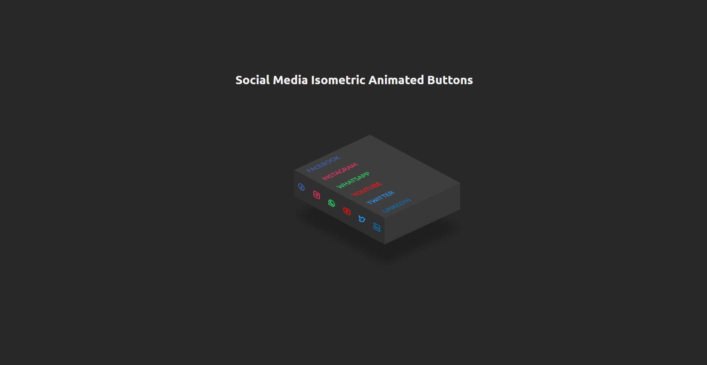

<h1 style="text-align:center">Isometric social media buttons</h1>

<br />



<br />

<div style="height: 1px; width: 100%; background-color: gray;">

<br />

## 🧾 Projeto

<br />

Este é apenas um pequeno projeto de uma animação que vi nas redes sociais e decidi entender como era feito para praticar conhecimentos em CSS, principalmente em pseudo-elementos (```after e before```) e efeito de ```hover```. Como dito é algo bem simples apenas para aprimorar e aprofundar meus conhecimentos.

<br />

## ⚙ Tecnologias

<br />

- HTML
- CSS

<br />

## 🏁 Finalização

Como já disse acima, foi algo bem simples de ser feito, mas é bom ter esses pequenos projeto para manter conhecimentos afiados e aprimorar ainda mais o que já foi aprendido!

<br />
<br />

<div style="height: 1px; width: 100%; background-color: gray;">

<br />

<p style="text-align:center">Desenvolvido com 💜 por Lucas P.</p>